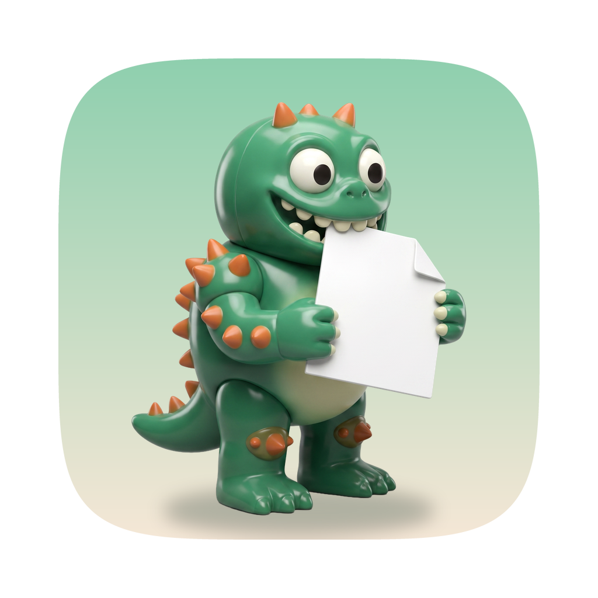
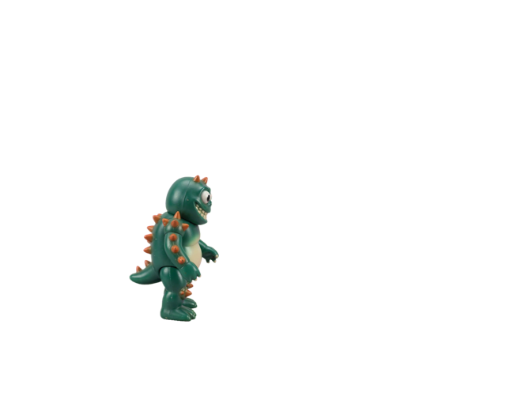
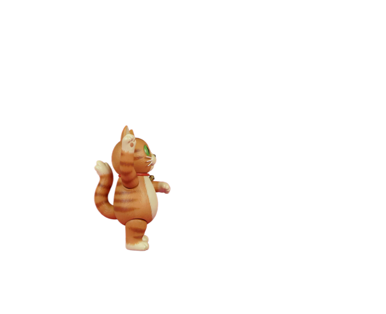
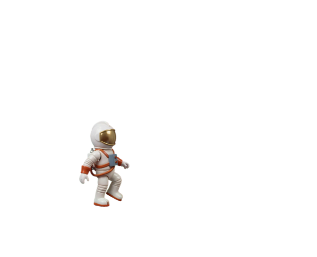

  
  <h1>MonsterDeleter</h1>
  
<strong>A very dramatic trip to the Trash.</strong>

  
macOS 15+ · Apple silicon and Intel · Native macOS app

Your Mac already has a Trash. It was missing the monster.

Right-click a file, summon a tiny menace, and let it ask before making a scene. MonsterDeleter
walks in, kicks your unwanted files into an explosion, then catches a ride home.
Behind the theatrics, your files simply go to the Mac's Trash.

Does this need a monster? Absolutely not. That's why it's here.

## Get MonsterDeleter

**The first public download is being prepared. No public release is available yet.**
Watch the [Releases page](https://github.com/kuan0808/MonsterDeleter/releases) for the
first signed and notarized build, or [build it yourself](docs/development.md#build-and-install).

The release will have **one universal app for macOS 15 or later**. The same download works on
Apple silicon and Intel; there is no processor choice to make.

Once a release is available:

1. Download the **DMG** from its assets, open it, and drag MonsterDeleter into **Applications**.
   The **ZIP** contains the same app if you prefer to unzip and copy it yourself.
2. Open MonsterDeleter once and follow the short introduction. Look for its icon in the menu
   bar; it does not occupy the Dock.
3. Choose **Play Demo** from the menu bar to meet your monster using a scratch file.

Each release includes installation instructions and SHA-256 checksums. GitHub's automatic
“Source code” archives are for developers; download the MonsterDeleter DMG or ZIP to install.

## Feed the monster

1. In Finder, select a file, a folder, or a whole selection.
2. Right-click and choose **Services > Feed to Monster**.
3. When the monster asks, either button confirms. **Esc** or a click outside cancels while
   it is asking. Both buttons say yes, because monsters are terrible at interface design.

If the service is missing, check that MonsterDeleter is running. You can also enable it in
**System Settings > Keyboard > Keyboard Shortcuts > Services**. The app's **Guide** has more help.

## Pick your accomplice

Three deeply unqualified waste-management professionals:

| Kaiju | Cat | UFO |
| :---: | :---: | :---: |
|  |  |  |
| A little monster. A big entrance. | Your files have offended the cat. | One small kick for an astronaut. |

Open **Settings** with **⌘,** to switch characters, turn sound on or off, or install a character
pack from a ZIP. You can also swap characters beside the monster's question.

## Small monster, sensible boundaries

- **Trash only.** MonsterDeleter never permanently deletes files or empties the Trash. It
  reports files it could not move. Finder handles restoration; Put Back availability and
  restored names can vary.
- **Permission is optional.** By default, the show aims at your right-click. Turn on
  **Aim at each file's icon** in Settings and grant Accessibility permission for precise icon
  targeting. Declining keeps the normal show working.
- **No screen recording needed.** Icon aiming reads Finder's selected-item positions when you
  summon a show. It does not need Screen Recording permission.

To uninstall, quit from the menu bar and move the app to the Trash. To remove installed
character packs and caches too, delete `~/Library/Application Support/MonsterDeleter`.

## Tinker with it

Built with Swift, SwiftUI and AppKit. No Xcode project or package dependencies.

- [Development guide](docs/development.md): build, test, character packs and architecture.
- [Release guide](docs/releasing.md): versioned builds, signing and publication.
- [Report a bug or suggest an idea](https://github.com/kuan0808/MonsterDeleter/issues).

## Credits & inspiration

- [531149627/MonsterDeleter](https://github.com/531149627/MonsterDeleter), the original Windows
  desktop toy, supplied the wonderfully unnecessary idea and show inspiration. This macOS
  implementation was built independently; its built-in characters and icons were generated
  for this project, and no upstream artwork is included in this repository.
- [Maccy](https://github.com/p0deje/Maccy), [Gifski](https://github.com/sindresorhus/Gifski) and
  [Plash](https://github.com/sindresorhus/Plash) helped inspire this README's icon, clear download
  instructions and screenshots. They are presentation references, not app dependencies.
- The [vendored Swift and macOS skills](.agents/skills/SKILLS-LOCK.md) retain their authors'
  credits and original license notices.

## License

The original app source, scripts and documentation are [MIT licensed](LICENSE), copyright
2026 kuan0808. Vendored skills retain their own MIT licenses and copyright notices; see the
[third-party notices](.agents/skills/SKILLS-LOCK.md).

Generated media is separate from that source-code license. The graphics and audio in
`Packaging/packs/`, artwork in `Packaging/Icon/`, and their copies and depictions in
`docs/images/` are **not covered by the MIT grant**. They were generated through KIE using
Nano Banana and Seedance for character artwork, Suno V5 for the nine shipped sounds, and
Nano Banana with Recraft background removal for the icons. See the
[media provenance and artwork guide](docs/artwork.md).

KIE [advertises commercial use](https://kie.ai/suno-api). Generated media remains subject to
the applicable provider terms, including [KIE's terms](https://kie.ai/terms-of-use); this
repository does not grant a separate MIT sublicense for those outputs.
